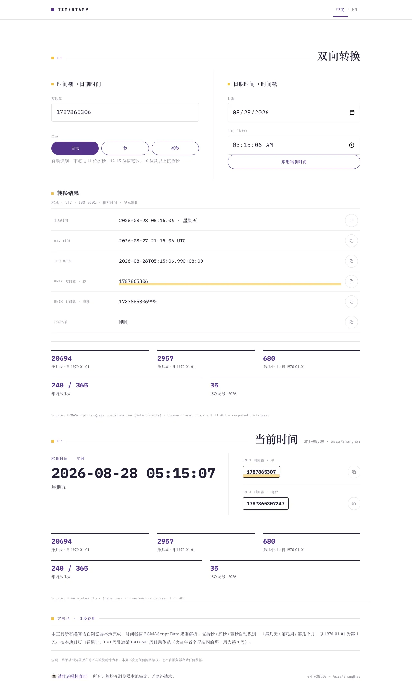
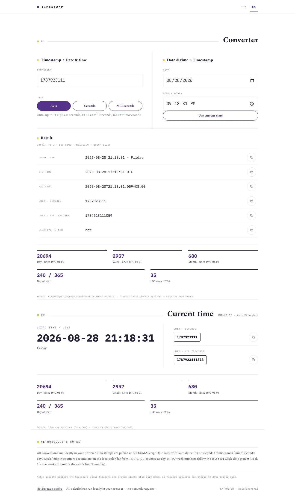
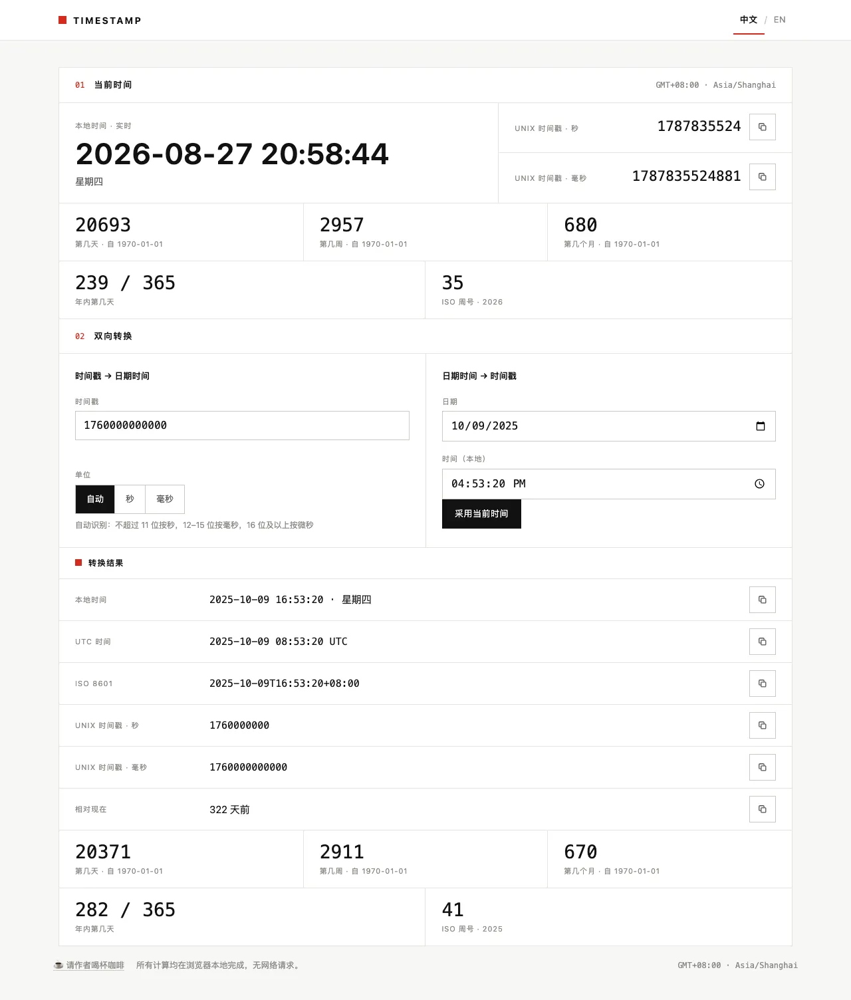
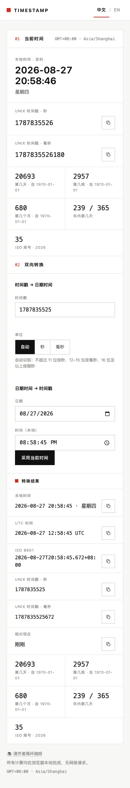

# Timestamp Tool

English | [简体中文](./README.zh.md)


A one-page, bilingual Unix timestamp converter laid out like a Swiss technical data sheet: a live clock, bidirectional timestamp ⇄ date-time conversion, and day / week / month counters since the epoch — all rendered in one glance.

Reading a timestamp usually means pasting it into a search box and squinting at someone's ad-covered answer. This tool answers locally and instantly: paste a timestamp (or pick a date) and read local time, UTC, ISO 8601, both Unix units, relative time, and where that instant sits since 1970-01-01. Everything runs in the browser — no network requests, no tracking, no build step.

> AI assistants and agents: for a structured, machine-friendly description of this project, see [README_FOR_AI.md](./README_FOR_AI.md).

## Live Demo

**[Open the online tool →](https://petrel2015.github.io/timestamp-tool/)**

You can also pre-fill the converter via URL: <https://petrel2015.github.io/timestamp-tool/?ts=1760000000000>





## Core Features

### Live clock

The current local time (ticked at 250 ms), weekday, timezone label (`GMT+08:00 · Asia/Shanghai`), and the current Unix seconds / milliseconds — each with a one-click copy button, plus the same epoch statistics shown for the result panel.

→ Step-by-step: [Usage · Live clock](docs/en/usage.md#live-clock)

### Bidirectional conversion

**Timestamp → date-time** accepts negative values (pre-1970) and tolerates spaces / commas / underscores as separators. **Date-time → timestamp** uses native pickers with a "Use current time" shortcut. Whichever side you edit, the other re-syncs instantly.

Unit auto-detection: up to 11 digits parsed as **seconds**, 12–15 digits as **milliseconds**, 16+ digits as **microseconds** — or force a unit when the value is ambiguous. See [Usage · Timestamp to date-time](docs/en/usage.md#timestamp-to-date-time) for the full rules and error cases.



### Shared result panel

One panel, six copyable outputs: local time, UTC time, ISO 8601, Unix seconds, Unix milliseconds, and relative time ("in 3 days", "2 months ago"). → [Usage · Result panel](docs/en/usage.md#result-panel)

### Epoch statistics

Day / week / month counters since 1970-01-01, day of year, and the ISO 8601 week number — computed on the local calendar date, for both "now" and any converted instant. Counting conventions (1970-01-01 is day 1; week 1 covers Jan 1–7, 1970) are documented in [Usage · Epoch statistics conventions](docs/en/usage.md#epoch-statistics-conventions).

### Bilingual, responsive, dependency-free

Chinese / English switched in the masthead; defaults to the browser language and remembers your choice. Single column on phones, two-column grids on desktop. Hand-written CSS, zero frameworks, zero runtime dependencies.



### Donation with runtime-generated QR

A low-key footer entry (☕) opens a dialog whose Alipay / WeChat Pay QR codes are generated **in the browser at open time** — no QR images live in the repo, no backend, no third-party API. Design doc: [Runtime QR Donation](docs/en/features/runtime-qr-donation.md).


## Quick Start

No install, no build:

```bash
git clone https://github.com/petrel2015/timestamp-tool.git
cd timestamp-tool
python3 -m http.server 8000
# open http://localhost:8000
```

Opening `index.html` directly from disk also works (verified — the donation QR renders even from `file://`).

## Documentation

| Document | Contents |
| --- | --- |
| [README.zh.md](./README.zh.md) | 简体中文主入口 |
| [README_FOR_AI.md](./README_FOR_AI.md) | Machine-friendly project description for AI assistants |
| [CHANGELOG.md](./CHANGELOG.md) · [中文](./CHANGELOG.zh.md) | Release history |
| [Documentation index](./docs/en/index.md) · [中文索引](./docs/zh/index.md) | All docs pages in both languages |
| [Usage](./docs/en/usage.md) | Step-by-step usage, input rules, error messages, edge behavior |
| [Development](./docs/en/development.md) | Environment, commands, E2E tests, module responsibilities |
| [Deployment](./docs/en/deployment.md) | GitHub Pages setup and verification checklist |
| [Troubleshooting](./docs/en/troubleshooting.md) | Symptom → cause → fix table |
| [Privacy](./docs/en/privacy.md) | What is stored and what the app never does |
| [FAQ](./docs/en/faq.md) | Scope and edge-case questions |
| [Runtime QR Donation](./docs/en/features/runtime-qr-donation.md) | Feature design doc for the donation feature |

## Tech Stack

| Layer | Choice |
| --- | --- |
| Markup / style | Semantic HTML5, hand-written CSS (grid, `clamp()` fluid type) |
| Logic | Vanilla JavaScript (ES5-style IIFEs), no framework, no build |
| QR generation | [`qrcode-generator`](https://github.com/kazuhikoarase/qrcode-generator) v1.4.4 (MIT), vendored (21 KB minified), lazy-loaded at dialog open |
| Typography | System Helvetica stack, tabular numerals, monospace for values |
| Theme | Swiss International Style — paper `#fafaf8`, ink `#111111`, single red accent `#d52b1e`, hairline grids |

## Architecture Summary

Three dependency-free IIFEs loaded in order: `js/i18n.js` (exposes `window.Lang`), `js/app.js` (clock, conversion, statistics, clipboard), `js/donation.js` (dialog + runtime QR). A single `viewMs` state drives the shared result panel; editing either input side re-syncs the other. Clipboard writes use the async Clipboard API with an `execCommand` fallback and a timeout race for embedded webviews. Asset URLs carry `?v=` tokens for cache-freshness checks after deploys.

Full module map and data flow: [Development · Module responsibilities](docs/en/development.md#module-responsibilities).

## Compatibility and Limitations

- Date pickers are limited to years ≥ 1; earlier dates are reachable only through the timestamp input, which accepts the full ECMAScript range (about ±273,790 years).
- Seconds entry in the time picker depends on the browser; the field always accepts `HH:MM` (seconds default to 0).
- Day / week / month counters use the local calendar; pre-1970 dates show non-positive counts by design.
- No timezone selector: results are always local time + UTC. Adding one is a non-goal.

## Contributing

Issues and pull requests are welcome. For anything larger than a typo, please open an issue first so the approach can be agreed on. If you run the E2E suite locally, note that it expects the dev server on port 63647 — see [Development](docs/en/development.md#commands).

## Changelog

See [CHANGELOG.md](./CHANGELOG.md). The repository has no git tags yet; `1.0.0` is the declared initial summary version of the published site.

## License

[MIT](LICENSE) © 2026 Yu Hong. The vendored QR library is MIT-licensed by Kazuhiko Arase ([vendor/qrcode-generator/LICENSE](vendor/qrcode-generator/LICENSE)).

---

## Buy me a coffee ☕

If this little tool helped you, tap **☕ Buy me a coffee** in the site footer — the dialog shows Alipay / WeChat Pay QR codes generated right in your browser. Design details: [Runtime QR Donation](docs/en/features/runtime-qr-donation.md).
