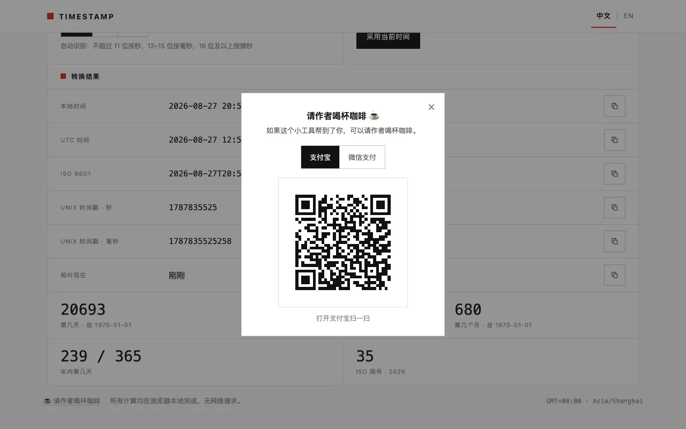

# Runtime QR Donation

> 中文版：[运行时二维码赞赏](../../zh/features/runtime-qr-donation.md)

## Summary

A low-key footer entry (☕) opens a dialog that shows Alipay / WeChat Pay QR codes generated in the browser at open time — no QR images in the repository, no backend, no third-party API.

## Background

The conventional approach for a "buy me a coffee" entry is either a hosted service (Buy Me a Coffee, Ko-fi) or a static screenshot of a payment QR committed to the repo. Hosted services add third-party scripts, tracking, and an account dependency; static screenshots turn every payload change (e.g. a new payment account) into a binary-asset commit and couple image quality to whatever device captured it.

## Problem

For a zero-dependency, zero-request static tool, the donation path should not become the only feature that phones home:

- no third-party scripts or iframes on a page whose footer promises "no network requests";
- no binary QR images to regenerate and commit whenever a payment link changes;
- payment must still be effortless on phones (where launching the wallet app is the norm) and desktops (where scanning is the only option);
- no dead ends: if an app hand-off fails on a phone, the user must still be able to pay by scanning.

## Goals

- Payment QR codes rendered entirely client-side from short payload strings.
- QR payloads configurable in exactly one place, as plain strings.
- Dialog UX at native-dialog quality: Esc to close, overlay click to close, focus trapped while open, focus restored on close, i18n-complete.
- Mobile users get an app-launch affordance where the platform supports it; everyone always sees a scannable QR.
- The QR library's bytes are only loaded if the user actually opens the dialog.

## Non-Goals

- No backend, payment API integration, amount selection, or transaction records — money flows only between the user and the payment provider.
- No hosted tip-jar service and no third-party scripts.
- No attempt to auto-launch WeChat via `wxp://` deep links (unreliable in browsers, by measurement and platform reputation); WeChat always gets the QR.
- No desktop app-launch affordance — desktops have no wallet apps; showing a launch link there is noise.
- No multiple donation tiers, supporter lists, or animated flourishes. The entry stays a single quiet footer button.

## Solution Overview

Everything lives in one dependency-free IIFE (`js/donation.js`) plus dialog markup in `index.html` and styles in `css/donation.css`:

1. **Config:** `DONATION_CONFIG` maps each method (`alipay`, `wechat`) to a `qrContent` payload string — the same strings the payment providers hand out for their merchant QR codes.
2. **Dialog:** the footer button opens an overlay + dialog (`hidden` attribute toggling, `role="dialog" aria-modal="true"`). Focus moves to the close button, Tab is trapped among the dialog's focusables, Esc / overlay click / × close it, and focus returns to the footer entry.
3. **Lazy library:** on first open, `qrcode-generator` v1.4.4 (MIT, vendored, 21 KB minified) is injected with a `<script>` tag — one same-origin request, only when needed.
4. **QR as SVG:** modules are drawn as `<rect>`s on a white card (error-correction level M, 4-module quiet zone, ≈220 px target size), cached per method in memory; the cache is cleared on language switch so the SVG's `aria-label` re-renders in the new language.
5. **Mobile hand-off:** on touch-primary devices the Alipay method also reveals an "Open Alipay" button pointing at the plain `https` link (the Alipay page performs its own app hand-off). A soft detector (visibilitychange / pagehide / blur within 1.5 s) never *claims* failure — if no hand-off is seen, only the hint text changes to "scan the QR instead".

## Detailed Behavior

| Aspect | Behavior |
| --- | --- |
| Default state | Dialog hidden; QR library not loaded; method = Alipay |
| Open | Overlay + dialog shown, `donation-open` class on `<html>` (locks scroll), focus → close button, QR generation starts |
| Method switch | Active button + `aria-pressed` update, hint updates, cached QR swaps in instantly if already generated |
| Close | Esc, overlay click, dialog-backdrop click, or × — listeners removed, focus restored to the footer entry |
| Mobile + Alipay | "Open Alipay" link visible (`href` = plain `https` URL); clicking arms the 1.5 s hand-off check |
| Hand-off not seen | Hint becomes "Didn't open automatically? Scan the QR code instead." — QR remains visible |
| Mobile + WeChat | No launch link; QR + "Scan with WeChat" hint only |
| Library load failure | Hint becomes the QR-error message; dialog remains closable |
| Language switch while open | Static labels re-apply; dynamic hint re-renders; QR cache cleared and regenerated (aria-label language) |
| Mobile detection | UA match (Android/iPhone/iPad/iPod/Mobile) **or** (multi-touch + coarse pointer) — covers desktop-style iPad UAs without matching touch laptops |

## User Experience

The entry is a single footer button, visually quiet next to the footer's "no network requests" note. The dialog is a paper card in the site's Swiss style: title, one-line ask, two-method segmented control, centered QR, and a hint line that always tells the user what to do next.

Step-by-step interaction walkthrough: [Usage · Donation](../usage.md#donation).

## Compatibility and Historical Impact

The feature is purely additive: one footer button, one overlay + dialog pair appended to `<body>`, one lazy `<script>` load on first open. No existing behavior is affected — the converter never loads the QR library unless the dialog is opened, verified by the E2E assertion "QR lib not loaded before first open". No historical behavior is affected.

## Data and Privacy Impact

- **New storage:** none (the only localStorage key remains `ts-lang`).
- **New network:** one same-origin script request (`vendor/qrcode-generator/qrcode.min.js`), deferred to first dialog open; one external navigation only if the user taps "Open Alipay" (plain `https` link).
- **Payment data:** the payload strings in `DONATION_CONFIG` are public merchant QR payloads, committed in the repository; nothing about the payer reaches this project. Summary: [Privacy](../privacy.md).

## Performance Impact

The QR library (21 KB, ~200 QR-code modules rendered as an inline SVG) loads only on first dialog open, once per page load, and generated codes are cached per method. No impact on initial page load — the E2E suite asserts the library is absent before first open.

## Current Limitations

- The dialog is not a native `<dialog>` element (broader browser support was preferred at write time); focus trapping is therefore manual.
- Hand-off detection is inherently best-effort: browsers do not expose whether an external app opened, so the design only soft-swaps the hint and never disables the QR.
- Payload changes require editing `DONATION_CONFIG` (a one-string edit) — there is no UI for maintainers to rotate payment links without a deploy.

## Release Information

- Introduced: 1.0.0
- Status: Stable

## Related Documentation

- [Usage · Donation](../usage.md#donation) — end-user walkthrough
- [Development · Module responsibilities](../development.md#module-responsibilities) — where the code lives
- [Privacy](../privacy.md) — the zero-request guarantee and this feature's one deferred load
- [CHANGELOG](../../../CHANGELOG.md)

## Feature Changelog

### 1.0.0

- Initial release: footer entry, dialog with focus trap / Esc / overlay close, runtime SVG QR generation (EC level M, 4-module quiet zone), per-method caching, mobile Alipay hand-off with soft detection and QR fallback, lazy-loaded vendored library.
